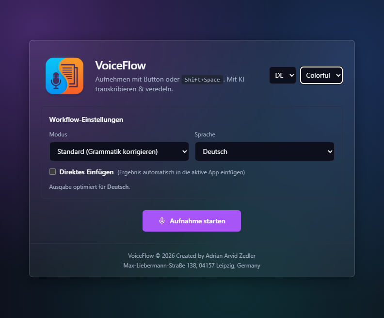

# VoiceFlow — Der intelligente Desktop-Assistent

**Das Problem:** Ob Bachelorarbeit, E-Mail-Flut oder Meeting-Protokoll – der Weg vom Gedanken zum fertigen Text ist oft mühsam. Wertvolle kognitive Energie geht beim Tippen und Formulieren verloren.
**Die Lösung:** VoiceFlow ist eine native Desktop-Anwendung, die gesprochene Gedanken nicht nur transkribiert, sondern *versteht* und direkt in das benötigte Format (akademisch, geschäftlich, strukturiert) übersetzt.


#

## 🚀 Key Features

### 🎓 Wissenschaftlicher Modus ("Der Bachelor-Retter")
Ein Modus speziell für akademisches Arbeiten.
* **Das Konzept:** Trennung von kognitiver Leistung (Gedanke) und handwerklicher Formulierung (Schreiben).
* **Funktion:** Du diktierst deine rohen Gedanken, Hypothesen oder Analyse-Ergebnisse. VoiceFlow transformiert diese in präzises, wissenschaftliches Hochdeutsch (Nominalstil, passiv), ohne den Inhalt zu verfälschen.
* *Ideal um Schreibblockaden bei Abschlussarbeiten zu überwinden.*

### 🧠 Kontext-Antworten ("Context Reply")
Die App liest (auf Wunsch) deine Zwischenablage.
* **Szenario:** Du kopierst eine komplexe E-Mail.
* **Befehl:** "Sag freundlich ab, aber schlag nächste Woche vor."
* **Ergebnis:** Eine perfekt formulierte Antwort, die auf den Kontext der E-Mail eingeht.

### ⚡ Magic Paste & Workflow
* **Direct Paste:** Das Fenster muss nicht offen bleiben. Der fertige Text wird "geisterhaft" direkt in dein aktives Word-Dokument, Outlook oder Slack getippt.
* **Globaler Hotkey:** Mit `Shift + Space` ist VoiceFlow sofort da – und mit einem Klick wieder weg (System Tray).

### 🎨 Personalisierung
* **Themes:** Wähle zwischen Hell, Dunkel oder dem modernen "Colorful"-Gradient-Look.
* **Sprache:** UI komplett umschaltbar (Deutsch / Englisch).
* **Grammatik-Engine:** Erzwingt standardmäßig Hochdeutsch, selbst wenn umgangssprachlich diktiert wird.

---

## 🛠 Tech Stack ("The Winning Stack")

VoiceFlow setzt auf maximale Performance bei minimalem Ressourcenverbrauch:

* **Frontend:** Next.js 15 + React 19 (Modernes UI).
* **Desktop Runtime:** Tauri v2 (Rust). Extrem performant und sicher.
* **KI-Backend:** Groq API.
    * *Inferenz:* Llama 3 (70b) für logische Strukturierung und Nuancen.
    * *Transkription:* Whisper (Large v3) für exakte Spracherkennung.
* **System:** Rust-Hooks für Clipboard-Management und Input-Simulation (`enigo`, `arboard`).

---

## 📦 Installation & Setup

### Voraussetzungen
* Node.js & npm
* Rust (via `rustup`)
* Ein API-Key von [Groq](https://console.groq.com)

### Quick Start

1.  **Repository klonen:**
    ```bash
    git clone [https://github.com/AdrianZeoGer/AdrianZeoGer-VoiceFlow---AI-Productivity-Assistant.git](https://github.com/AdrianZeoGer/AdrianZeoGer-VoiceFlow---AI-Productivity-Assistant.git)
    cd voiceflow
    npm install
    ```

2.  **API Konfigurieren:**
    Erstelle eine `.env.local` Datei:
    ```bash
    NEXT_PUBLIC_OPENAI_API_KEY=gsk_DEIN_GROQ_KEY
    NEXT_PUBLIC_OPENAI_BASE_URL=[https://api.groq.com/openai/v1](https://api.groq.com/openai/v1)
    NEXT_PUBLIC_LLM_MODEL=llama-3.3-70b-versatile
    ```

3.  **Starten (Dev Mode):**
    ```bash
    npm run tauri dev
    ```

4.  **Bauen (Release):**
    ```bash
    npm run tauri build
    ```
    *(Die fertige .exe findest du unter `src-tauri/target/release`)*

---

## 👤 Über das Projekt

**VoiceFlow** wurde entwickelt, um die Lücke zwischen schnellem Sprechen und professionellem Schreiben zu schließen. Der Fokus liegt darauf, den Nutzer im "Flow" zu halten, statt ihn durch Formatierungsarbeit auszubremsen.

**Entwickler:** Adrian Arvid Zedler
**Standort:** Leipzig, Deutschland

*© 2026 Adrian Arvid Zedler. Alle Rechte vorbehalten.*
